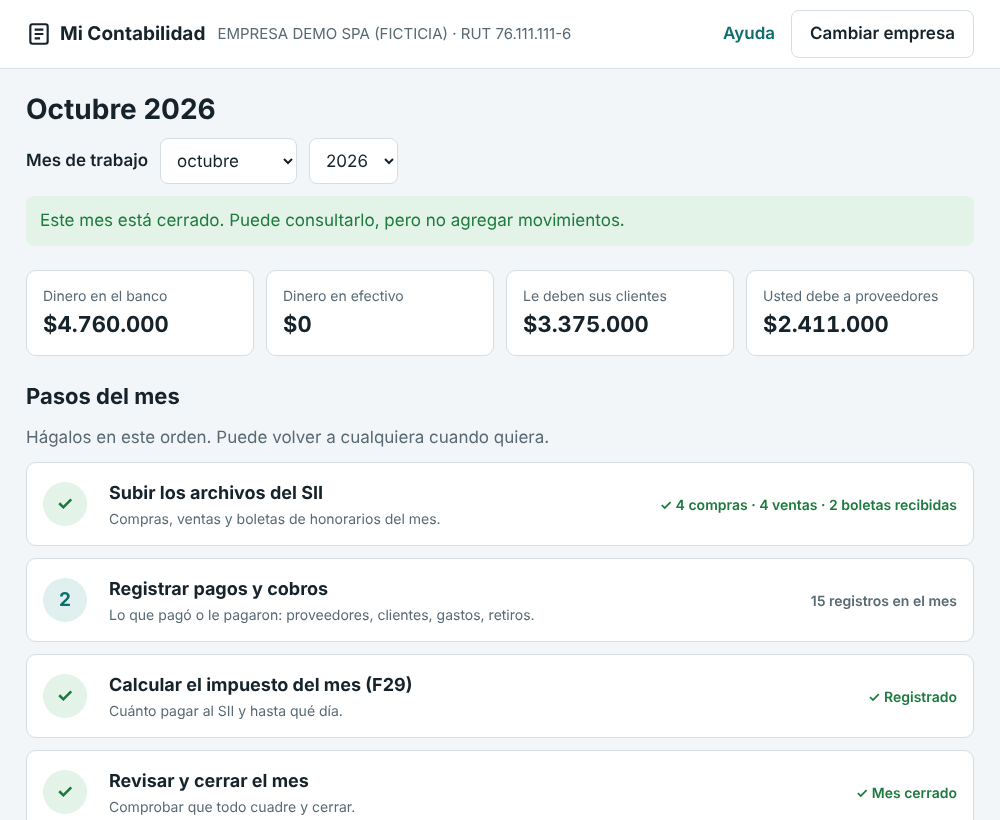
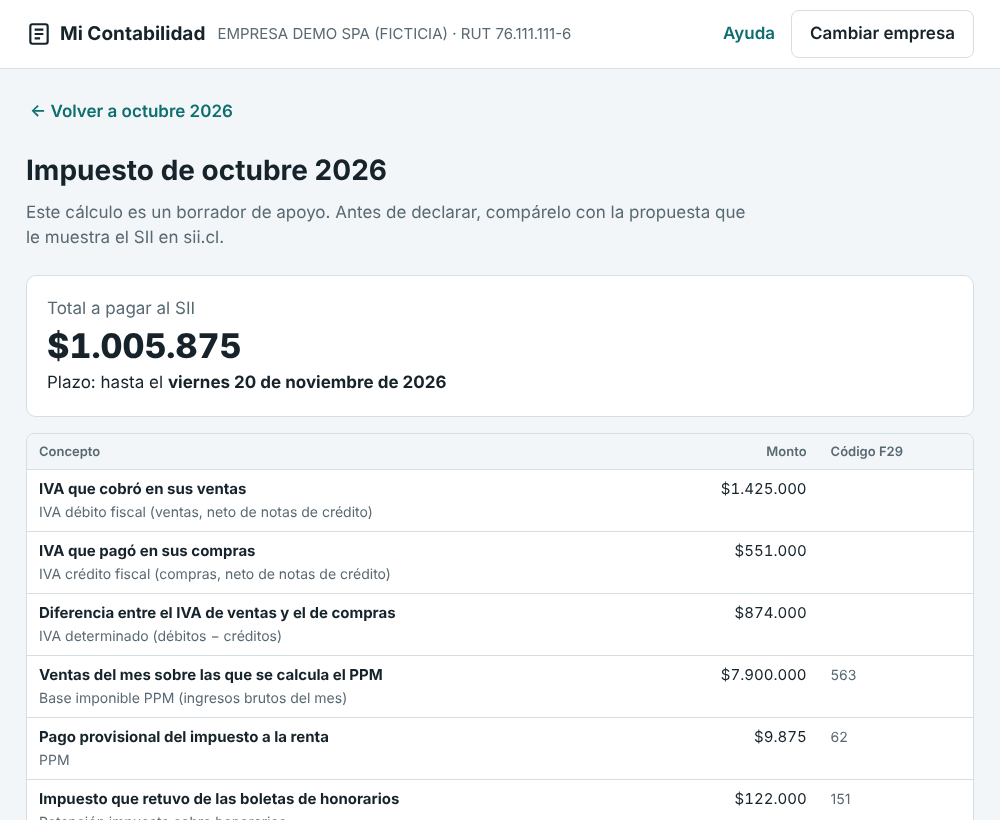
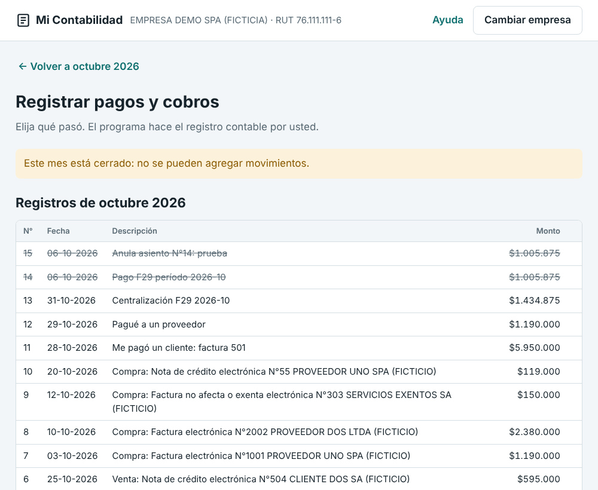

# contasii — contabilidad automatizada para contribuyentes chilenos

Programa para llevar la contabilidad de **una empresa o una persona natural** a partir de
los archivos que entrega el SII:

- detalle del **Registro de Compras y Ventas (RCV)**,
- boletas de honorarios electrónicas, recibidas y emitidas.

Con eso genera los asientos, los libros y un borrador del F29. Se usa con **ventanas y
botones en el navegador**, sin escribir comandos. También tiene una versión de línea de
comandos para contadores.

> **Alcance.** Es una herramienta de apoyo. El cálculo del F29 es un borrador para
> cotejar con la propuesta del SII en sii.cl. No reemplaza la declaración ni la revisión
> profesional. Antes de presentar cualquier cifra ante el SII o un cliente, haga la
> verificación documental.

## Cómo empezar (para cualquier persona)

### Windows: instalador, sin Python

1. Descargue **`Instalar-MiContabilidad.exe`** desde la sección **Releases** del
   repositorio, versión «Mi Contabilidad 0.1.0 (preliminar)».
2. Haga doble clic en el archivo. El programa no está firmado digitalmente, así que
   Windows puede mostrar **«Windows protegió su PC»**: presione **«Más información»** y
   luego **«Ejecutar de todos modos»**.
3. Siga el asistente. No pide permisos de administrador y crea el acceso directo
   **«Mi Contabilidad»** en el Escritorio y en el menú Inicio.
4. Abra **Mi Contabilidad**. Aparece una ventana negra y, enseguida, el navegador con el
   programa. **No cierre la ventana negra mientras trabaja**; al terminar, ciérrela.

Los datos se guardan en **Documentos\Mi Contabilidad**. Por eso desinstalar o instalar
una versión nueva no borra la contabilidad.

En la misma página de descarga hay una versión sin instalar,
`MiContabilidad-portable.zip`: se descomprime y se abre `MiContabilidad.exe`.

El instalador lo construye automáticamente GitHub Actions
(`.github/workflows/instalador-windows.yml`) en un Windows real. Antes de publicarlo,
el proceso ejecuta las pruebas, instala el programa y recorre el flujo del mes con
los datos de ejemplo.

### Mac, Linux o Windows con Python

1. **Instale Python** (una sola vez) desde <https://www.python.org/downloads/>.
   En Windows, al instalar, marque la casilla **"Add Python to PATH"**.
2. **Copie la carpeta `contabilidad-sii`** a su computador, por ejemplo al Escritorio.
3. **Haga doble clic en el archivo de inicio:**
   - Windows: `ABRIR CONTABILIDAD (Windows).bat`
   - Mac: `Abrir contabilidad (Mac).command`. La primera vez puede pedir permiso: clic
     derecho → Abrir.

Si falta Python, el archivo de inicio lo avisa y abre la página de descarga. La primera
vez también instala solo el complemento para Excel, lo que requiere internet. Con esta
forma de uso, los datos quedan en la carpeta `mis_empresas/`, junto al programa.

### Qué verá

Cada mes se trabaja en **4 pasos**, en lenguaje simple:

| Paso | Qué hace la persona |
|---|---|
| 1. Subir los archivos del SII | Arrastra los CSV de compras, ventas y boletas. El programa reconoce cuál es cuál, muestra cuántos documentos y qué total trae cada uno, y pide confirmar antes de registrarlos. |
| 2. Registrar pagos y cobros | Elige lo que pasó ("Me pagó un cliente", "Pagué a un proveedor", "Pagué el impuesto mensual"…), escribe monto y fecha, e indica banco o efectivo. El programa arma el asiento contable. |
| 3. Calcular el impuesto (F29) | Ve el total a pagar, la fecha límite y el detalle explicado en palabras simples, y confirma para registrarlo. |
| 4. Revisar y cerrar el mes | Ve las comprobaciones de cuadratura en verde o rojo y cierra el mes. |

La pantalla de inicio muestra el dinero en el banco y en efectivo, cuánto le deben los
clientes y cuánto debe a proveedores. Las acciones que no se pueden deshacer, como
anular un registro o cerrar el mes, piden confirmación en pantalla. En "Libros e
informes" están el Diario, el Mayor, el Balance de 8 columnas, el estado de resultados
y la descarga a Excel.





### Dónde quedan los datos

Todo se guarda en **Documentos\Mi Contabilidad** si usa el instalador, o en la carpeta
**`mis_empresas/`**, junto al programa, si lo usa con Python. Hay un archivo por RUT. La
pantalla de Ayuda muestra la ubicación exacta. Nada se envía a internet: el programa solo acepta conexiones desde el mismo
computador. **Respalde esa carpeta** con regularidad, por ejemplo en OneDrive o en un
pendrive.

## Probar la conexión con el SII y el certificado digital

En el programa, el botón **«Conexión SII»** de la barra superior abre una pantalla con
dos pruebas:

1. **Conexión.** No necesita certificado. Pide al SII una semilla, que es el primer paso
   de la «autenticación automática» descrita en el *Manual de Desarrollador
   Autenticación Automática* del SII.
2. **Certificado digital.**
   - Usted elige su archivo `.pfx` o `.p12` y escribe la clave.
   - El programa muestra a nombre de quién está el certificado y su vigencia.
   - Luego firma la semilla y pide un token al SII. Si el SII entrega el token, el
     certificado funciona con sus servicios web.

Por defecto se usa el **ambiente de pruebas del SII** (certificación, `maullin.sii.cl`).
También puede elegirse producción (`palena.sii.cl`). Ninguna de las dos pruebas envía ni
modifica declaraciones.

El archivo del certificado y su clave se usan **solo en memoria** y no se guardan.

La firma XML (`contasii/sii_ws.py`) tiene estas características:
- es envuelta, con C14N inclusiva, RSA-SHA1 y digest SHA1;
- su KeyInfo incluye KeyValue y X509Data;
- se verificó con libxmlsec1 en las pruebas automáticas.

### Resultado de la prueba contra el SII real

Se probó el 06-10-2026 en el ambiente de certificación, desde GitHub Actions:

- **Semilla:** el SII la entregó con estado `00`.
- **Formato:** la definición del servicio (WSDL) confirma la operación `getToken` con el
  parámetro `pszXml`.
- **Certificado autofirmado de prueba:** el SII respondió *«XML Inválido, elemento
  ‘Certificate’ no existe, función getCertificado»*.

Según el manual oficial, los errores de formato o de firma son los estados 01 a 05 y la
falta de semilla es el 06. Se infiere, sin confirmación expresa del SII, que la firma pasó
la validación y que se rechazó el certificado por no ser reconocido. El manual indica que
solo se permite autenticarse con un certificado digital válido.

**Falta la prueba con un certificado real.**

## Qué automatiza

| Función | Detalle |
|---|---|
| Partida doble | Rechaza asientos descuadrados y líneas en cuentas no imputables o inexistentes. Numera en forma correlativa y sin saltos. |
| Inalterabilidad | Los asientos no se borran ni se editan. Se anulan con un contra-asiento. Cada asiento lleva un hash SHA-256 encadenado al anterior, y `verificar` detecta cualquier modificación directa de la base. |
| Cierre de períodos | Un período cerrado no admite asientos nuevos. |
| Importación del RCV | Lee compras y ventas, reconoce columnas por nombre y valida RUT (módulo 11). Omite duplicados (tipo + RUT + folio). Invierte los signos de las notas de crédito. Separa activo fijo, IVA no recuperable, IVA de uso común y otros impuestos. Trata aparte las facturas de compra (DTE 46). Contabiliza por documento o en una centralización mensual. |
| Honorarios | Recibidos: gasto, retención por pagar y líquido por pagar. Emitidos: ingreso y retención como pago provisional. Omite las boletas anuladas y compara la retención informada con la tasa del año. |
| Libros | Diario, Mayor con saldo acumulado, Balance tributario de 8 columnas con prueba de cuadratura y Estado de resultados. |
| F29 (borrador) | Débito, crédito, remanente anterior (reajustado por UTM si está cargada), remanente siguiente, base y monto del PPM según régimen, retención de honorarios, impuesto único y total. Puede generar el asiento de centralización de IVA/PPM. |
| Impuesto único 2ª cat. | Cálculo por tramos en UTM. |
| Plazos | Vencimiento del F29: día 12, o día 20 para quien declara por internet y emite documentos electrónicos. |
| Controles | Cuadra el IVA del auxiliar de documentos contra el Mayor, cuenta los documentos sin RUT válido y revisa la integridad. |
| Exportación | Excel con hojas Diario, Mayor, Balance, Compras, Ventas, Honorarios, F29 e Integridad, y CSV. |
| Obligaciones | Lista de libros y obligaciones según el régimen, con su norma y estado de verificación. |

Regímenes: `14A` (general), `14D3` (Pro Pyme general), `14D8` (Pro Pyme transparente)
y `PN_HONORARIOS` (persona natural con rentas del art. 42 N°2 LIR).

## Uso por línea de comandos (contadores)

```bash
cd contabilidad-sii
C="python3 -m contasii --db mi_empresa.db"     # una base por RUT

$C init --rut 76.111.111-6 --razon "MI EMPRESA SPA" --tipo empresa --regimen 14D3
$C importar-rcv RCV_COMPRA_202610.csv --libro compra --periodo 2026-10
$C importar-rcv RCV_VENTA_202610.csv  --libro venta  --periodo 2026-10
$C importar-honorarios bhe_recibidas.csv --sentido recibido --periodo 2026-10
$C asiento --fecha 2026-10-31 --glosa "Pago proveedor" --linea 2.1.01:1190000:0:76111111-6 --linea 1.1.02:0:1190000

$C f29 2026-10                      # propuesta de trabajo; agregue --contabilizar --guardar-remanente
$C controles 2026-10                # cuadraturas
$C balance --periodo 2026-10
$C exportar --periodo 2026-10 --excel octubre.xlsx
$C cerrar 2026-10                   # cierra el período tras revisar
$C verificar                        # integridad de toda la base
$C obligaciones
```

Opciones del F29:

| Opción | Uso |
|---|---|
| `--impuesto-unico N` | Monto que viene del libro de remuneraciones. |
| `--tasa-ppm 0.0xx` | Obligatoria en régimen 14A, donde la tasa es propia de cada contribuyente. |
| `--factor-uso-comun 0.xx` | Proporción de crédito por IVA de uso común. |
| `--remanente-anterior N` | Remanente del período anterior. |
| `--papel` | Usa el plazo del día 12. |

Para probar con datos ficticios, use los archivos de `ejemplos/`. Para correr las pruebas:

```bash
python3 -m unittest discover -s tests -v
```

## Parámetros tributarios y su verificación

Las tasas, la tabla del impuesto único, la UTM, los plazos y los códigos del F29 están en
`contasii/parametros/2026.json`. Cada valor lleva su norma, su fuente y un estado:

| Estado | Significado |
|---|---|
| `VERIFICADO` | Una persona leyó la norma en la fuente oficial. |
| `FUENTE_OFICIAL_INDIRECTA` | Dato tomado el 06-10-2026 de buscadores acotados a sii.cl y bcn.cl, **sin lectura directa del documento**, porque el acceso a esos sitios estaba bloqueado desde el entorno de desarrollo. |
| `PENDIENTE` | No se confirmó. El valor es `null` y el sistema **se niega a calcular** lo que depende de él. |

Todo parámetro usado que no esté en `VERIFICADO` aparece en los reportes bajo
**[VERIFICAR]**. Al leer la fuente, cambie el estado a `VERIFICADO`.

Valores cargados para 2026, todos `FUENTE_OFICIAL_INDIRECTA` salvo que se indique:

| Concepto | Valor | Norma |
|---|---|---|
| IVA | 19% | art. 14 DL 825 |
| Retención honorarios 2026 | 15,25% (2027: 16%; 2028: 17%) | art. 74 N°2 LIR; gradualidad Ley 21.133 |
| PPM 14 D N°3 | 0,125% (≤ 50.000 UF o primer año) | Ley 21.755; Circular SII N°53/2025 |
| PPM 14 D N°8 | 0,2% (≤ 50.000 UF) | art. 14 D N°8 LIR |
| PPM 14 A | `PENDIENTE`: tasa propia de cada contribuyente | art. 84 a) LIR |
| IDPC 14 A / 14 D N°3 | 27% / 12,5% (años comerciales 2025-2027, condicionado) | art. 20 LIR; Ley 21.755 |
| Plazo F29 | Día 12; día 20 si declara por internet y emite documentos electrónicos | art. 64 DL 825; D.S. Hacienda N°1.001/2006 |
| UTM octubre 2026 | $72.151 | sii.cl, Valores y fechas |
| Tabla impuesto único | Tramos 13,5 / 30 / 50 / 70 / 90 / 120 / 310 UTM; tasas 0% a 40% | art. 43 N°1 LIR |
| RCV | Res. Ex. SII N°61, de 12-07-2017 | — |

**Riesgo normativo vigente.** Según prensa no verificada en el Diario Oficial, un proyecto
de ley (Boletín 18.216-05) que modifica tasas del IDPC estaba por promulgarse en octubre
de 2026. Revise el Diario Oficial antes de usar tasas de 2027 en adelante.

**Debe cargar usted:**

- la UTM de cada mes (`utm`), necesaria para reajustar el remanente y calcular el impuesto único.
  En la interfaz gráfica, la pantalla del F29 la pide cuando falta y la guarda en
  `mis_empresas/parametros_locales.json`;
- los feriados del año (`feriados`);
- la regla de prórroga del vencimiento en días inhábiles.

Para un año nuevo, copie `2026.json` a `AAAA.json` y actualice cada valor con su fuente.

## Qué NO hace (todavía)

- No se conecta a sii.cl: los archivos se descargan a mano. Para eso existe el skill `descargar-sii-rcv`.
- No envía libros contables electrónicos al SII ni genera sus formatos oficiales.
- No calcula la corrección monetaria, la depreciación tributaria, la RLI, el F22, los registros
  empresariales (RAI, SAC, etc.) ni las declaraciones juradas.
- No calcula remuneraciones completas (AFP, salud, seguro de cesantía). Solo calcula el
  impuesto único sobre una renta tributable ya determinada.
- No aplica por sí solo la proporcionalidad del IVA de uso común, el cambio de sujeto en
  ventas con IVA retenido ni el tratamiento definitivo de las facturas de compra. Esos
  casos los deja como alertas.
- La lista exacta de columnas del CSV del RCV no fue verificada documentalmente. El
  importador valida que existan las columnas requeridas y se detiene si falta alguna.

## Estructura

```
contasii/
  libro.py          núcleo contable (asientos, Diario, Mayor, Balance, integridad)
  db.py             esquema SQLite
  rcv.py            importación del Registro de Compras y Ventas
  honorarios.py     boletas de honorarios
  impuestos.py      F29, impuesto único, vencimientos
  parametros.py     carga de parámetros con estado de verificación
  obligaciones.py   obligaciones por régimen
  reportes.py       texto, CSV y Excel
  cli.py            línea de comandos
  web.py            interfaz gráfica (servidor local en 127.0.0.1)
  web/index.html    pantallas de la interfaz
  operaciones.py    operaciones en lenguaje simple ("Me pagó un cliente"...)
  controles.py      cuadraturas del período
  sii_ws.py         autenticación con los servicios web del SII (semilla, firma, token)
  datos/plan_cuentas.json   plan de cuentas sugerido (editable, no oficial)
  parametros/2026.json      parámetros tributarios 2026
ejemplos/           datos ficticios
tests/              pruebas unitarias
docs/               capturas de pantalla
empaquetado/        instalador de Windows: punto de entrada, ícono, script de Inno Setup
                    y prueba de humo del .exe
ABRIR CONTABILIDAD (Windows).bat / Abrir contabilidad (Mac).command   archivos de inicio
```
